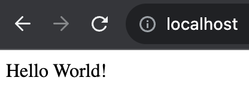
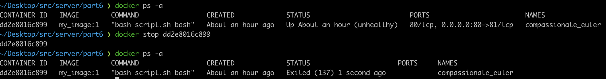

## Part 1. Готовый докер

- Для начала запускаем Docker Desktop и выкачиваем официальный докер-образ с **nginx** при помощи `docker pull`  
    

- Проверь наличие докер-образа через `docker images`
    

- Запусти докер-образ через `docker run -d [image_id|repository]`   
    
> флаг '-d' - запустят в фоновом режиме ("detached mode")

- Проверь, что образ запустился через `docker ps`  
    
> Команда `docker ps` используется для получения списка (по умолчанию только запущенных) контейнеров  

- Посмотри информацию о контейнере через `docker inspect [container_id|container_name]`  
    
> Вывод команды docker inspect представляет собой JSON-объект,
> содержащий подробную информацию о контейнере, включая его конфигурацию, сетевые настройки, состояние и тд.  

>     
> По выводу команды определи и помести в отчёт:  
> - полный размер файловой системы контейнера (SizeRootFs) и размер записанных данных (SizeRw) - 0 байт
> - список замапленных портов - порт 80/tcp не замаплен на хост-машину
> - ip контейнера - 172.17.0.2  

- Останови докер контейнер через `docker stop [container_id|container_name]`  
- Проверь, что контейнер остановился через `docker ps`  
    

- Запусти докер с портами 80 и 443 в контейнере, замапленными на такие же порты на локальной машине, через команду *run*.  
    
> `-d` -  Запускает контейнер в фоновом режиме (detached mode)  
>`-p` 80:80 -  Маппит порт 80 контейнера на порт 80 хоста  
>`-p` 443:443 -  Маппит порт 443 контейнера на порт 443 хоста  

- Проверь, что в браузере по адресу *localhost:80* доступна стартовая страница **nginx**:  
1. Открываем и вводим в адресной строке браузера: http://localhost:80  
2. И так же проверяем командой `curl localhost:80`  
     

- Перезапусти докер контейнер через `docker restart [container_id|container_name]`  
- Проверь любым способом, что контейнер запустился  
    

## Part 2. Операции с контейнером

- Прочитай конфигурационный файл *nginx.conf* внутри докер контейнера через команду *exec*  
    
> Команда позволяет выполнить команду внутри запущенного контейнера  

- Создай на локальной машине файл *nginx.conf*  
- Настрой в нем по пути */status* отдачу страницы статуса сервера **nginx**  
> `nano nginx.conf` - создаем и открываем файл nginx.conf  
> пишем конфигурацию nginx  
     

- Скопируй созданный файл *nginx.conf* внутрь докер-образа через команду `docker cp`  
> `docker cp` - команда позволяет копировать файлы между локальной машиной и контейнером  
> Чтобы скопировать файл nginx.conf внутрь контейнера -> 
> указываем путь к файлу на локальной машине и путь внутри контейнера
  

- Перезапусти **nginx** внутри докер-образа через команду *exec*.  
> docker exec - команда для выполнения команды внутри контейнера  
> c09329bf79fd - идентификатор контейнера  
> nginx -s reload - команда для перезапуска nginx внутри контейнера  
  

- Проверь, что по адресу *localhost:80/status* отдается страничка со статусом сервера **nginx**  
    

- Экспортируй контейнер в файл *container.tar* через команду *export*  
> Docker export — это команда, которая позволяет архивировать и распространять файловую систему контейнера на другой машине.
> Команда записывает текущее состояние файловой системы в образ контейнера и экспортирует изображение в виде архива.
> Базовый синтаксис команды: docker export [container-name-or-id] > [filename].tar 
> Важные моменты :  
> Файл container.tar содержит все слои образа, что может сделать его довольно большим  
> Полезно для передачи образов между разными системами,  
> где Docker не может напрямую обращаться к репозиторию образов (например, при отсутствии доступа к Интернету).  
> После загрузки образа из container.tar, вы можете использовать его как обычный Docker-образ.  
и проверили наличие файла  
  

- Останови контейнер  
  
 
- Удали образ через `docker rmi [image_id|repository]`, не удаляя перед этим контейнеры  
> (--force)  
    

- Удали остановленный контейнер  
> `docker ps -a` - показывает все контейнеры (как запущенные, так и остановленные)  
> `docker rm` для удаления контейнера  
  

- Импортируй контейнер обратно через команду *import*  
    

- Запусти импортированный контейнер  
> `docker run` - команда для запуска контейнера  
> -d - запускает контейнер в фоновом режиме (detached mode)  
> -p 80:80 -p 443:443 - маппит порты 80 и 443 контейнера на порты 80 и 443 хоста  
> --entrypoint /bin/sh - переопределяет точку входа контейнера на /bin/sh  
> import_my_nginx - имя образа для запуска  
> `-c "nginx -g 'daemon off;'"` - команда для запуска nginx в фоновом режиме  

- Проверь, что по адресу *localhost:80/status* отдается страничка со статусом сервера **nginx**  
    

## Part 3. Мини веб-сервер

> Полезная информация:  
> Интерфейс FastCGI — клиент-серверный протокол взаимодействия веб-сервера и приложения, дальнейшее развитие технологии CGI.
> По сравнению с CGI является более производительным и безопасным.
> FastCGI снимает множество ограничений CGI-программ. Недостаток CGI-программ — в том, что они должны быть перезапущены веб-сервером при каждом запросе, — что приводит к понижению производительности. FastCGI (вместо того, чтобы создавать новые процессы для каждого нового запроса) использует постоянно запущенные процессы для обработки множества запросов;
> это позволяет экономить время.

- Напиши мини-сервер на **C** и **FastCgi**, который будет возвращать простейшую страничку с надписью `Hello World!`  
> src/server/part3/server.c  
    
- Напиши свой *nginx.conf*, который будет проксировать все запросы с 81 порта на *127.0.0.1:8080*  
src/server/part3/nginx.conf  
  

- Составляющие HTTP{} блока:
> `include /etc/nginx/mime.types;` - файл, который содержит список расширений файлов и соответствующих им MIME-типов. MIME-типы используются для указания типа контента, который передается по сети, например, в HTTP-запросах и ответах.
> - Определение типа контента : MIME-типы позволяют серверу и клиенту определить тип контента (№ MIME-тип text/html или MIME-тип image/jpeg);  
> - Правильная обработка контента;  
> - Безопасность : № если MIME-тип указывает, что контент является текстом, браузер не попытается выполнить его как код  

> `default_type application/octet-stream;` - Устанавливает тип MIME по умолчанию для файлов, тип которых не может быть определен;  

> `log_format  main` - Определяет формат логов - `main`;  
>$remote_addr: IP-адрес клиента
>$remote_user: Имя пользователя  
>$time_local: Локальное время сервера.
>$request: HTTP-запрос  
>$status: Статус HTTP-ответа  
>$body_bytes_sent: Количество байт, отправленных клиенту  
>$http_referer: URL, с которого пришел запрос  
>$http_user_agent: User-Agent клиента  
>$http_x_forwarded_for: IP-адрес клиента, если запрос проксировался  

> `sendfile on;` - Включает отправку файлов напрямую из ядра операционной системы, что ускоряет передачу файлов  
> `#tcp_nopush  on;` - Улучшает производительность при отправке файлов  

> ` keepalive_timeout  65;` - Устанавливает таймаут для keep-alive соединений в секундах  
> > Keep-Alive соединения — это механизм, который позволяет поддерживать постоянное соединение между клиентом (например, браузером) и сервером (например, веб-сервером) для нескольких HTTP-запросов и ответов. Это позволяет избежать необходимости устанавливать новое соединение для каждого запроса, что ускоряет обработку запросов и уменьшает нагрузку на сервер.  
> - не закрывает соединение после каждого запроса, а оставляет его открытым для последующих запросов =>
> 1) Уменьшение нагрузки на сервер  
> 2) Ускорение обработки запросов
> 3) Экономия ресурсов

- Составляющие server{} блока:
> `listen 81;` - порт, на котором будет работать сервер  
> `server_name localhost;` - имя  
>> `location / { ... }` - Блок настроек для обработки запросов к корневому URL (/)  
>> `fastcgi_pass 127.0.0.1:8080;` - адрес FastCGI-сервера, на который будут проксироваться запросы

- Запусти написанный мини-сервер через *spawn-fcgi* на порту 8080  
>Запускаем контейнера на 81 порту с образа nginx  
> `docker run -d -p 81:81 nginx`  
> 
> Копируем nginx.conf и server.c в докер-контейнер  
>   
> Входим в контейнер и проверяем, что файлы скопировались  
> `Команда docker exec -it id_контейнера bash_команда используется для выполнения произвольных команд внутри Docker-контейнера.`  
> Обновляем контейнер `apt-get update` и устанавливаем `apt install0 gcc spawn-fcgi libfcgi-dev`    
>   
> Заходим в `/etc/nginx#`  
> Компилируем и запускам сервер - `gcc server.c -lfcgi`   
> Перезапускаем контейнер `spawn-fcgi -p 8080 ./a.out`  
> перезагружаем конфигурации`service nginx reload`  
> и проверяем страницу браузера `curl localhost:81`  
>   
- Проверь, что в браузере по *localhost:81* отдается написанная тобой страничка  
  

>> переносим nginx.conf в ./nginx  
  

## Part 4. Свой докер
*При написании докер-образа избегай множественных вызовов команд RUN*

- Напиши свой докер-образ, который:
 >1) собирает исходники мини сервера на FastCgi из [Части 3](#part-3-мини-веб-сервер);
 >2) запускает его на 8080 порту;
 >3) копирует внутрь образа написанный *./nginx/nginx.conf*;
 >4) запускает **nginx**.  

- Пишем Dockefile  
    
- Пишем скрипт script.sh для запуска процессов fcgi и nginx  
    

- Собери написанный докер-образ при этом указав имя и тег` docker build -t my_image:1 .`
- Проверь через `docker images`, что все собралось корректно.
- Запусти собранный докер-образ с маппингом 81 порта на 80 на локальной машине и маппингом папки *./nginx* внутрь контейнера по адресу, где лежат конфигурационные файлы **nginx** -  
- `docker run -it -d -p 80:81 --mount type=bind,source=$(pwd)/nginx/nginx.conf,target=/etc/nginx/nginx.conf my_image:1`  
>> `-it`: включает интерактивный режим (-i) и ассоциирует терминал (-t) с контейнером     
>> `-d`: запускает контейнер в фоновом режиме (detached mode)           
>> `-p 80:81`: маппим порт 80 хоста на порт 81 контейнера  
>> Первый номер (80) - это порт на вашем хосте, а второй номер (81) - это порт внутри контейнера                    
>> `--mount` type=bind,source=./nginx/nginx.conf,target=/etc/nginx/nginx.conf: Этот аргумент монтирует файл nginx.conf из хоста внутрь контейнера ->  
>> `type=bind` означает, что используется прямое связывание (bind mount)  
>> `source=./nginx/nginx.conf` указывает путь к файлу nginx.conf на хосте  
>> `target=/etc/nginx/nginx.conf` указывает путь, по которому этот файл будет доступен в контейнере  
>> `my_image:1` : Это имя Docker-образа  

    
- Проверь, что по localhost:80 доступна страничка написанного мини сервера  
    
>> При возникновении ошибок полезные команды :
>> `lsof -i :81` - проверка, что этот порт свободен;

- Допиши в *./nginx/nginx.conf* проксирование странички */status*, по которой надо отдавать статус сервера **nginx**.  
    
- Перезапусти докер-образ 
>Если всё сделано верно, то, после сохранения файла и перезапуска контейнера, конфигурационный файл внутри докер-образа должен обновиться самостоятельно без лишних действий*  

  

- Проверь, что теперь по *localhost:80/status* отдается страничка со статусом **nginx**  
    

## Part 5. **Dockle**

>>Dockle — это инструмент для сканирования Docker-образов на наличие уязвимостей и несоответствий лучшим практикам безопасности. Он помогает убедиться, что ваши образы соответствуют стандартам безопасности.  

>Сначала установим Dockle используя команду `brew install goodwithtech/r/dockle`  

> Так как на маках нет прав,сначала делаем файл .tar - `docker save -o for_dockle.tar my_image`
- Просканируй образ из предыдущего задания через `dockle --input for_dockle.tar -i CIS-DI-0010`.  
    

>Испавляем Dockerfile - теперь выглядят так:  
>    
> chmod u-s <файл>: Удаляет бит setuid у указанного файла  
>> Бит setuid позволяет пользователю запускать программу с правами владельца этой программы  
> chmod g-s <файл>: Удаляет бит setgid у указанного файла  
>> Бит setgid позволяет пользователю запускать программу с правами группы, к которой принадлежит эта программа
>chown -R myuser:myuser /var/cache/nginx /var/run /home: Устанавливает владельцем этих директорий непривилегированного пользователя  

>Пересобираем образ и контейнер из 4part,чтобы убедиться в корректной работе:  
>    

- Исправь образ так, чтобы при проверке через **dockle** не было ошибок и предупреждений  
     

## Part 6. **Базовый Docker Compose**  ##

>> Docker Compose — это инструмент для определения и запуска многоконтейнерных приложений.  
>> https://habr.com/ru/companies/ruvds/articles/450312/  

>Напиши файл docker-compose.yml, с помощью которого:
>1) Подними докер-контейнер из Части 5 (он должен работать в локальной сети, т.е. не нужно использовать инструкцию EXPOSE и мапить порты на локальную машину).
>2) Подними докер-контейнер с nginx, который будет проксировать все запросы с 8080 порта на 81 порт первого контейнера.

> Dockerfile fcgo_server, script.sh, server.c (без изменений):  
>    

> Dockerfile nginx_server, nginx.conf:  
>     

> docker-compose.yml:  
>     

- Останови все запущенные контейнеры  
  

- Собери и запусти проект с помощью команд docker-compose build и docker-compose up  
    

- Проверь, что в браузере по localhost:80 отдается написанная тобой страничка, как и ранее  
    
